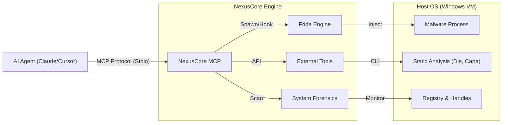

# NexusCore MCP

   

**NexusCore MCP** is an advanced **Model Context Protocol (MCP)** server specifically designed for **AI-driven dynamic malware analysis**. It bridges the gap between Large Language Models (LLMs) like Claude/GPT-4 and low-level system instrumentation, enabling AI agents to actively debug, inspect, and analyze evasive malware in real-time.

> **Why NexusCore?**
> Traditional sandboxes give you a static report. NexusCore allows an AI agent to **interactively** manipulate malware execution—bypassing anti-debugging checks (Themida/VMProtect) via Frida, dumping memory, and performing forensic triage on the fly.

---

## 🏗️ Architecture



---

## 🚀 Features & Tools

### 🛡️ Dynamic Analysis & Evasion (`src/tools/malware/`)
| Tool | Description | Key Tech |
|------|-------------|----------|
| **`spawn_process`** | Spawns malware in **suspended state** and injects **Stealth Unpacker** script to bypass Anti-Debug/VM checks. | **Frida** |
| **`find_oep`** | Analyzes entry point instructions to detect unpacking loops and identify the Original Entry Point (OEP). | **Iced-x86** |
| **`cape_submit`** | Automates submission of samples to a **CAPEv2 Sandbox** instance and retrieves full JSON reports. | **Reqwest** |
| **`die_scan`** | Detects compilers, packers, and crypto signatures (e.g., "Themida 2.x"). | **Detect It Easy** |
| **`yara_scan`** | Scans files using YARA rules for signature matching. | **YARA-rs** |
| **`pe_fixer`** | Parses PE headers and simulates section alignment/entry point fixups. | **Goblin** |
| **`iat_fixer`** | Rebuilds Import Address Table (IAT) from a dumped process. | **Scylla** |

### 🔍 System Forensics (`src/tools/system/`)
| Tool | Description |
|------|-------------|
| **`scan_persistence`** | Scans Registry Run keys and Startup folders to detect auto-start mechanisms. |
| **`scan_handles`** | Lists open handles and **Mutexes** (vital for IOC extraction) of a running process. |

### 🔧 Core Instrumentation (`src/tools/common/`)
| Tool | Description |
|------|-------------|
| **`attach_process`** | Attaches to an existing running process by PID. |
| **`resume_process`** | Resumes a suspended process. |

---

## ⚡ Quick Start (Zero-to-Hero)

### 1. Unified Environment Setup
We provide an **All-in-One Powershell script** that sets up a complete analysis environment on a clean Windows VM.
It installs **Rust, Python, Build Tools, Chocolatey**, and downloads **Frida, Die, Capa, Sysinternals**.

Run as **Administrator**:
```powershell
./scripts/setup_tools.ps1
```

### 2. Configuration (`.env`)
Create a `.env` file in the root directory:

```ini
# .env
CAPE_API_URL=http://192.168.1.100:8000
CAPE_API_TOKEN=your_token_optional
RUST_LOG=info
```

### 3. Build & Run
```bash
cargo build --release
./target/release/nexuscore_mcp.exe
```

---

## 🤖 AI Integration Guide (Claude Desktop / Cursor)

Add the following to your MCP Client configuration (e.g., `claude_desktop_config.json`):

```json
{
  "mcpServers": {
    "nexuscore": {
      "command": "C:\\Path\\To\\NexusCore_MCP\\target\\release\\nexuscore_mcp.exe",
      "args": [],
      "env": {
        "CAPE_API_URL": "http://127.0.0.1:8000"
      }
    }
  }
}
```

---

## 📚 Analysis Scenario: "Cracking Themida"

1.  **Initial Triage**:
    *   Agent calls `die_scan` -> Result: "Themida / WinLicense 2.x".
    *   Agent calls `cape_submit` -> Result: "Timeout / Crashed" (Sandbox evasion detected).
2.  **Stealth Execution**:
    *   Agent calls `spawn_process(path="malware.exe", stealth=true)`.
    *   NexusCore spawns process bundled with `stealth_unpacker.js` to hook `IsDebuggerPresent` and `NtQueryInformationProcess`.
3.  **Behavior Monitoring**:
    *   Agent calls `scan_handles` to find Mutex `Global\GoGoMalware`.
    *   Agent calls `scan_persistence` and finds `HKCU\..\Run\Updater`.
4.  **dumping & Fixing**:
    *   Agent identifies unpacked code region.
    *   Agent calls `iat_fixer` to rebuild the binary.

---

## ⚠️ Disclaimer
This tool is intended for **authorized security research and malware analysis** only. The authors and contributors are not responsible for any misuse or damage caused by this software. **Always run malware in an isolated Virtual Machine.**

## License
MIT License