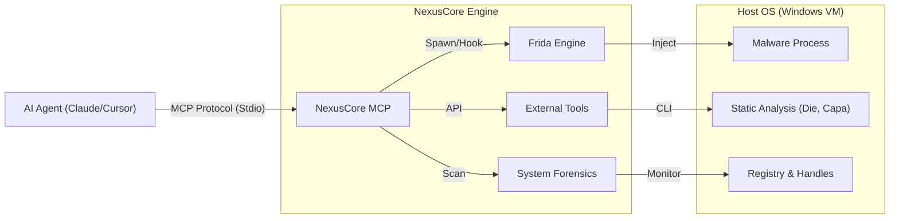

# NexusCore MCP

   

**English** | **[한국어](README_KR.md)**

**NexusCore MCP** is an advanced **Model Context Protocol (MCP)** server specifically designed for **AI-driven dynamic malware analysis**. It bridges the gap between Large Language Models (LLMs) like Claude/GPT-4 and low-level system instrumentation, enabling AI agents to actively debug, inspect, and analyze evasive malware in real-time.

> **Why NexusCore?**
> Traditional sandboxes give you a static report. NexusCore allows an AI agent to **interactively** manipulate malware execution—bypassing anti-debugging checks (Themida/VMProtect) via Frida, dumping memory, and performing forensic triage on the fly.

## 📑 Table of Contents
- [Architecture](#-architecture)
- [Features & Tools](#-features--tools)
- [Prerequisites](#-prerequisites)
- [Quick Start](#-quick-start-zero-to-hero)
- [AI Integration Guide](#-ai-integration-guide-claude-desktop--cursor)
- [Usage Examples](#-usage-examples)
- [Tool Reference](#-tool-reference)
- [Analysis Scenarios](#-analysis-scenario-cracking-themida)
- [Troubleshooting](#-troubleshooting)
- [Disclaimer](#️-disclaimer)

---

## 🏗️ Architecture



---

## 🚀 Features & Tools

### 🛡️ Dynamic Analysis & Evasion (`src/tools/malware/`)
| Tool | Description | Key Tech |
|------|-------------|----------|
| **`spawn_process`** | Spawns malware in **suspended state** and injects **Stealth Unpacker** script to bypass Anti-Debug/VM checks. | **Frida** |
| **`find_oep`** | Analyzes entry point instructions to detect unpacking loops and identify the Original Entry Point (OEP). | **Iced-x86** |
| **`cape_submit`** | Automates submission of samples to a **CAPEv2 Sandbox** instance and retrieves full JSON reports. | **Reqwest** |
| **`die_scan`** | Detects compilers, packers, and crypto signatures (e.g., "Themida 2.x"). | **Detect It Easy** |
| **`yara_scan`** | Scans files using YARA rules for signature matching. | **YARA-rs** |
| **`pe_fixer`** | Parses PE headers and simulates section alignment/entry point fixups. | **Goblin** |
| **`iat_fixer`** | Rebuilds Import Address Table (IAT) from a dumped process. | **Scylla** |

### 🔍 System Forensics (`src/tools/system/`)
| Tool | Description |
|------|-------------|
| **`scan_persistence`** | Scans Registry Run keys and Startup folders to detect auto-start mechanisms. |
| **`scan_handles`** | Lists open handles and **Mutexes** (vital for IOC extraction) of a running process. |

### 🔧 Core Instrumentation (`src/tools/common/`)
| Tool | Description |
|------|-------------|
| **`attach_process`** | Attaches to an existing running process by PID. |
| **`resume_process`** | Resumes a suspended process. |

---

## 📋 Prerequisites

Before you begin, ensure you have:

### System Requirements
- **OS**: Windows 10/11 (x64) - Preferably a clean **Virtual Machine** (VirtualBox/VMware)
- **RAM**: 4GB+ recommended
- **Disk Space**: 5GB+ for tools and dependencies

### Required Software (Auto-installed by setup script)
- [Chocolatey](https://chocolatey.org/) - Package manager
- [Rust](https://www.rust-lang.org/) (1.70+) - Compiler toolchain
- [Visual C++ Build Tools](https://visualstudio.microsoft.com/downloads/#build-tools-for-visual-studio-2022) - MSVC linker
- [Python 3.8+](https://www.python.org/) - For some analysis tools
- [Git](https://git-scm.com/) - Version control

### Analysis Tools (Auto-downloaded by setup script)
- **Detect It Easy (DIE)** - Packer/compiler detection
- **CAPA** - Capability analysis
- **FLOSS** - String extraction
- **Sysinternals Suite** - Process utilities

### Optional (for Full Functionality)
- **CAPEv2 Sandbox** - Remote malware submission (self-hosted or public instance)
- **Frida** - Dynamic instrumentation (auto-configured)

---

## ⚡ Quick Start (Zero-to-Hero)

### Step 1: Clone the Repository
```bash
git clone https://github.com/yourusername/NexusCore_MCP.git
cd NexusCore_MCP
```

### Step 2: Automated Environment Setup
We provide an **All-in-One PowerShell script** that configures your entire analysis environment.

**Run as Administrator** in PowerShell:
```powershell
Set-ExecutionPolicy Bypass -Scope Process -Force
.\scripts\setup_tools.ps1
```

This script will:
- ✅ Install Chocolatey package manager
- ✅ Install Rust, Python, Git, 7-Zip, and Visual C++ Build Tools
- ✅ Download DIE, CAPA, FLOSS, and Sysinternals tools to `.\bin\`
- ✅ Add tools to your system PATH

**⏱️ Expected time**: 10-15 minutes (depending on internet speed)

**After installation completes**, restart your terminal to apply PATH changes.

### Step 3: Configuration (`.env`)
Create a `.env` file in the root directory:

```ini
# .env - Configuration File
CAPE_API_URL=http://192.168.1.100:8000    # Your CAPEv2 instance (optional)
CAPE_API_TOKEN=your_token_here             # API token if required (optional)
RUST_LOG=info                              # Log level (trace, debug, info, warn, error)
```

> **Note**: If you don't have a CAPEv2 sandbox, you can skip this or use a public instance. The other tools will work independently.

### Step 4: Build NexusCore MCP
```bash
cargo build --release
```

**Build time**: 5-10 minutes (first build compiles all dependencies)

### Step 5: Test the Server
Run the MCP server standalone to verify it works:
```bash
.\target\release\nexuscore_mcp.exe
```

You should see:
```
[INFO] Starting NexusCore MCP Server (RMCP Standard)...
[INFO] Listening on Stdio...
```

**Press `Ctrl+C` to stop**. The server is now ready to integrate with AI clients.

---

## 🤖 AI Integration Guide (Claude Desktop / Cursor)

### For Claude Desktop

1. **Locate your Claude Desktop config file**:
   - **Windows**: `%APPDATA%\Claude\claude_desktop_config.json`
   - **macOS**: `~/Library/Application Support/Claude/claude_desktop_config.json`
   - **Linux**: `~/.config/Claude/claude_desktop_config.json`

2. **Edit the config file** and add NexusCore MCP:

```json
{
  "mcpServers": {
    "nexuscore": {
      "command": "C:\\Path\\To\\NexusCore_MCP\\target\\release\\nexuscore_mcp.exe",
      "args": [],
      "env": {
        "CAPE_API_URL": "http://127.0.0.1:8000",
        "RUST_LOG": "info"
      }
    }
  }
}
```

> **Important**: Replace `C:\\Path\\To\\NexusCore_MCP` with your actual installation path. Use double backslashes (`\\`) in Windows paths.

3. **Restart Claude Desktop** completely (Quit and reopen)

4. **Verify installation**: Start a new chat and type:
   ```
   Can you list all available NexusCore tools?
   ```
   Claude should respond with a list of malware analysis tools.

### For Cursor IDE

1. Open **Cursor Settings** → **MCP Servers**

2. Click **Add Server** and enter:
   - **Name**: `NexusCore`
   - **Command**: `C:\Path\To\NexusCore_MCP\target\release\nexuscore_mcp.exe`
   - **Environment Variables**:
     - `CAPE_API_URL`: `http://127.0.0.1:8000`
     - `RUST_LOG`: `info`

3. **Save** and restart Cursor

### For Other MCP Clients

Add the server configuration to your client's MCP settings using stdio transport:
- **Command**: Path to `nexuscore_mcp.exe`
- **Transport**: Stdio (stdin/stdout)
- **Protocol**: MCP (Model Context Protocol)

---

## 💬 Usage Examples

Here are real-world conversations showing how to interact with NexusCore through AI agents:

### Example 1: Quick Malware Triage
```
You: I have a suspicious file "invoice.exe". Can you analyze it?

Claude: I'll help you analyze invoice.exe. Let me start with static analysis.

[Claude calls die_scan tool]

Claude: The file is detected as:
- Compiler: Microsoft Visual C++ 8.0
- Packer: **UPX 3.96**
- Entropy: High (7.2/8.0) - Likely packed

Let me check for malware capabilities:

[Claude calls capa_tool]

Claude: CAPA detected the following capabilities:
- ✅ Network communication (HTTP)
- ✅ File modification
- ⚠️ Registry persistence
- ⚠️ Anti-debugging checks

Recommendation: This is likely malware. Proceed with dynamic analysis in a VM?
```

### Example 2: Bypassing Anti-Debug Protection
```
You: The malware crashes when I debug it. Can you help?

Claude: This suggests anti-debugging protection. I'll spawn it in stealth mode.

[Claude calls spawn_process with stealth=true]

Claude: Process spawned (PID: 4568) with Frida stealth hooks:
- IsDebuggerPresent() → FALSE
- NtQueryInformationProcess() → Patched
- CheckRemoteDebuggerPresent() → Bypassed

The process is now suspended. Let me scan for persistence:

[Claude calls scan_persistence]

Claude: Found persistence mechanism:
- Location: HKCU\Software\Microsoft\Windows\CurrentVersion\Run
- Key: "WindowsUpdate"
- Value: C:\Users\Admin\AppData\Roaming\svchost.exe

Should I resume the process and monitor its behavior?
```

### Example 3: Unpacking and Dumping
```
You: Can you unpack this Themida-protected binary?

Claude: I'll attempt to find the Original Entry Point (OEP).

[Claude calls spawn_process, then find_oep]

Claude: OEP Analysis:
- Current EIP: 0x004015A0 (Themida stub)
- Detected unpacking loop at 0x00401200
- OEP candidate: 0x00405000 (after 2,450 instructions)

Let me attach and dump the process memory:

[Claude calls attach_process, then memory dump]

Claude: Memory dumped (520 KB). Now fixing the Import Address Table:

[Claude calls iat_fixer]

Claude: IAT reconstructed with 89 imports. The unpacked binary is ready:
📁 Output: invoice_unpacked.exe

Would you like me to analyze the unpacked code with CAPA?
```

### Example 4: Network Behavior Analysis
```
You: What network connections does this malware make?

Claude: Let me spawn the process and monitor its behavior.

[Claude calls spawn_process, scan_handles]

Claude: Detected network activity:
- TCP connection to 192.168.45.23:8080
- HTTP User-Agent: "Mozilla/5.0"
- Mutex: Global\{5F2A8C9D-1234}

Let me check if this IP is known malicious...
[Continues analysis]
```

---

## 📚 Analysis Scenario: "Cracking Themida"

1.  **Initial Triage**:
    *   Agent calls `die_scan` -> Result: "Themida / WinLicense 2.x".
    *   Agent calls `cape_submit` -> Result: "Timeout / Crashed" (Sandbox evasion detected).
2.  **Stealth Execution**:
    *   Agent calls `spawn_process(path="malware.exe", stealth=true)`.
    *   NexusCore spawns process bundled with `stealth_unpacker.js` to hook `IsDebuggerPresent` and `NtQueryInformationProcess`.
3.  **Behavior Monitoring**:
    *   Agent calls `scan_handles` to find Mutex `Global\GoGoMalware`.
    *   Agent calls `scan_persistence` and finds `HKCU\..\Run\Updater`.
4.  **dumping & Fixing**:
    *   Agent identifies unpacked code region.
    *   Agent calls `iat_fixer` to rebuild the binary.

---

## 🔧 Tool Reference

Complete reference for all available tools with parameters and response formats.

### Process Management Tools

#### `spawn_process`
Spawns a process in suspended state with optional Frida instrumentation.

**Parameters:**
```json
{
  "path": "C:\\malware\\sample.exe",
  "stealth": true,              // Optional: Enable anti-debug bypass
  "args": ["--config", "test"]  // Optional: Command-line arguments
}
```

**Response:**
```json
{
  "pid": 4568,
  "status": "suspended",
  "stealth_enabled": true
}
```

#### `attach_process`
Attaches to an existing running process.

**Parameters:**
```json
{
  "pid": 4568
}
```

#### `resume_process`
Resumes a suspended process.

**Parameters:**
```json
{
  "pid": 4568
}
```

#### `inject_frida_script`
Injects custom Frida JavaScript into a process.

**Parameters:**
```json
{
  "pid": 4568,
  "script": "console.log('Hooked!'); Interceptor.attach(...);"
}
```

### Static Analysis Tools

#### `die_scan`
Detects packers, compilers, and protectors using Detect It Easy.

**Parameters:**
```json
{
  "file_path": "C:\\malware\\sample.exe"
}
```

**Response:**
```json
{
  "detections": ["UPX 3.96", "MSVS 2019"],
  "entropy": 7.2,
  "file_type": "PE32"
}
```

#### `capa_tool`
Analyzes malware capabilities using CAPA.

**Parameters:**
```json
{
  "file_path": "C:\\malware\\sample.exe"
}
```

**Response:**
```json
{
  "capabilities": [
    "create TCP socket",
    "enumerate files",
    "create registry key"
  ]
}
```

#### `floss_tool`
Extracts obfuscated strings using FLOSS.

**Parameters:**
```json
{
  "file_path": "C:\\malware\\sample.exe"
}
```

### Dynamic Analysis Tools

#### `find_oep`
Finds the Original Entry Point of packed executables.

**Parameters:**
```json
{
  "pid": 4568,
  "max_instructions": 10000
}
```

**Response:**
```json
{
  "oep_address": "0x00405000",
  "instructions_traced": 2450
}
```

#### `code_disassembler`
Disassembles code at a specific address.

**Parameters:**
```json
{
  "pid": 4568,
  "address": "0x00401000",
  "length": 100
}
```

#### `pe_fixer`
Fixes PE headers and sections of dumped executables.

**Parameters:**
```json
{
  "input_file": "C:\\dumps\\memory.bin",
  "output_file": "C:\\dumps\\fixed.exe"
}
```

#### `iat_fixer`
Rebuilds Import Address Table using Scylla.

**Parameters:**
```json
{
  "pid": 4568,
  "dump_file": "C:\\dumps\\memory.bin"
}
```

### System Forensics Tools

#### `scan_persistence`
Scans for persistence mechanisms.

**Parameters:**
```json
{
  "scan_registry": true,
  "scan_startup": true
}
```

**Response:**
```json
{
  "registry_keys": [
    {
      "hive": "HKCU",
      "path": "Software\\Microsoft\\Windows\\CurrentVersion\\Run",
      "name": "Updater",
      "value": "C:\\malware.exe"
    }
  ],
  "startup_files": []
}
```

#### `scan_handles`
Lists open handles and mutexes of a process.

**Parameters:**
```json
{
  "pid": 4568
}
```

**Response:**
```json
{
  "handles": [
    {
      "type": "File",
      "name": "C:\\Windows\\System32\\notepad.exe"
    },
    {
      "type": "Mutant",
      "name": "Global\\MyMalwareMutex"
    }
  ]
}
```

### Sandbox Tools

#### `cape_submit`
Submits a sample to CAPEv2 sandbox.

**Parameters:**
```json
{
  "file_path": "C:\\malware\\sample.exe",
  "timeout": 300
}
```

**Response:**
```json
{
  "task_id": 12345,
  "status": "completed",
  "score": 8.5,
  "signatures": ["ransomware", "persistence"]
}
```

---

## 🛠️ Troubleshooting

### Common Issues and Solutions

#### ❌ "nexuscore_mcp.exe not found" in Claude Desktop
**Solution:**
- Ensure you built the project: `cargo build --release`
- Use the **full absolute path** in your config: `C:\\Users\\YourName\\NexusCore_MCP\\target\\release\\nexuscore_mcp.exe`
- Use double backslashes (`\\`) in Windows paths

#### ❌ "Failed to spawn process" error
**Solution:**
- Run Claude Desktop/Cursor as **Administrator**
- Ensure the target executable exists and has read permissions
- Check if antivirus is blocking execution
- Verify Frida is installed: `pip install frida-tools`

#### ❌ "DIE/CAPA not found" errors
**Solution:**
- Re-run the setup script: `.\scripts\setup_tools.ps1`
- Manually add tools to PATH:
  ```powershell
  $env:Path += ";C:\NexusCore_MCP\bin\DetectItEasy"
  $env:Path += ";C:\NexusCore_MCP\bin\Capa"
  ```
- Restart your terminal

#### ❌ "Rust linker error" during build
**Solution:**
- Install Visual C++ Build Tools:
  ```powershell
  choco install visualcpp-build-tools -y
  ```
- Or download from: https://visualstudio.microsoft.com/downloads/#build-tools-for-visual-studio-2022

#### ❌ CAPEv2 connection timeout
**Solution:**
- Verify CAPE is running: Open `http://127.0.0.1:8000` in a browser
- Check `.env` file has correct `CAPE_API_URL`
- CAPE submission is optional - other tools work independently

#### ❌ "Access denied" when scanning processes
**Solution:**
- Run your MCP client (Claude Desktop/Cursor) as **Administrator**
- Some system processes are protected - use a VM for malware analysis

### Debug Mode

Enable verbose logging by setting in your `.env`:
```ini
RUST_LOG=debug
```

View logs in real-time:
```bash
.\target\release\nexuscore_mcp.exe 2> debug.log
```

### Getting Help

- **Issues**: [GitHub Issues](https://github.com/yourusername/NexusCore_MCP/issues)
- **Documentation**: Check the `/docs` folder (if available)
- **Community**: Join discussions in the repository

---

## ⚠️ Disclaimer
This tool is intended for **authorized security research and malware analysis** only. The authors and contributors are not responsible for any misuse or damage caused by this software. **Always run malware in an isolated Virtual Machine.**

## 📄 License
MIT License