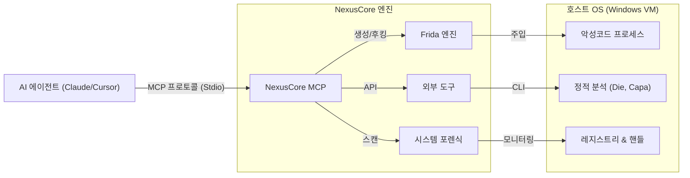

# NexusCore MCP

   

**[English](README.md)** | **한국어**

**NexusCore MCP**는 **AI 기반 동적 악성코드 분석**을 위해 특별히 설계된 고급 **Model Context Protocol (MCP)** 서버입니다. Claude/GPT-4와 같은 대형 언어 모델(LLM)과 저수준 시스템 계측 도구 사이의 다리 역할을 하여, AI 에이전트가 실시간으로 악성코드를 디버깅, 검사, 분석할 수 있게 합니다.

> **왜 NexusCore인가?**
> 기존 샌드박스는 정적인 보고서만 제공합니다. NexusCore는 AI 에이전트가 **대화형으로** 악성코드 실행을 조작할 수 있게 해줍니다—Frida를 통해 안티디버깅 체크(Themida/VMProtect)를 우회하고, 메모리를 덤프하며, 즉석에서 포렌식 분류를 수행합니다.

---

## 목차
- [아키텍처](#-아키텍처)
- [기능 및 도구](#-기능-및-도구)
- [사전 요구사항](#-사전-요구사항)
- [빠른 시작 가이드](#-빠른-시작-가이드)
- [AI 연동 가이드](#-ai-연동-가이드)
- [사용 예제](#-사용-예제)
- [도구 레퍼런스](#-도구-레퍼런스)
- [분석 시나리오](#-분석-시나리오)
- [문제 해결](#-문제-해결)
- [주의사항](#️-주의사항)

---

## 아키텍처



---

## 기능 및 도구

### 동적 분석 & 우회 도구 (`src/tools/malware/`)
| 도구 | 설명 | 핵심 기술 |
|------|------|----------|
| **`spawn_process`** | 악성코드를 **일시 중지 상태**로 생성하고 Anti-Debug/VM 체크를 우회하는 **스텔스 언패커** 스크립트를 주입합니다. | **Frida** |
| **`find_oep`** | 엔트리 포인트 명령어를 분석하여 언패킹 루프를 감지하고 원래 엔트리 포인트(OEP)를 식별합니다. | **Iced-x86** |
| **`cape_submit`** | **CAPEv2 샌드박스** 인스턴스에 샘플을 자동 제출하고 전체 JSON 보고서를 가져옵니다. | **Reqwest** |
| **`die_scan`** | 컴파일러, 패커, 암호화 시그니처(예: "Themida 2.x")를 탐지합니다. | **Detect It Easy** |
| **`yara_scan`** | YARA 규칙을 사용하여 시그니처 매칭을 위해 파일을 스캔합니다. | **YARA-rs** |
| **`pe_fixer`** | PE 헤더를 파싱하고 섹션 정렬/엔트리 포인트 수정을 시뮬레이션합니다. | **Goblin** |
| **`iat_fixer`** | 덤프된 프로세스에서 Import Address Table(IAT)을 재구성합니다. | **Scylla** |

### 시스템 포렌식 도구 (`src/tools/system/`)
| 도구 | 설명 |
|------|------|
| **`scan_persistence`** | 레지스트리 Run 키와 시작 프로그램 폴더를 스캔하여 자동 시작 메커니즘을 탐지합니다. |
| **`scan_handles`** | 실행 중인 프로세스의 열린 핸들과 **뮤텍스**(IOC 추출에 필수)를 나열합니다. |

### 핵심 계측 도구 (`src/tools/common/`)
| 도구 | 설명 |
|------|------|
| **`attach_process`** | PID로 기존 실행 중인 프로세스에 연결합니다. |
| **`resume_process`** | 일시 중지된 프로세스를 재개합니다. |
| **`inject_frida_script`** | 사용자 정의 Frida JavaScript를 프로세스에 주입합니다. |

---

## 사전 요구사항

### 시스템 요구사항
- **OS**: Windows 10/11 (x64) - 깨끗한 **가상 머신** 권장 (VirtualBox/VMware)
- **RAM**: 4GB 이상 권장
- **디스크 공간**: 도구 및 의존성을 위해 5GB 이상

### 필수 소프트웨어 (설치 스크립트로 자동 설치됨)
- [Chocolatey](https://chocolatey.org/) - 패키지 관리자
- [Rust](https://www.rust-lang.org/) (1.70+) - 컴파일러 툴체인
- [Visual C++ Build Tools](https://visualstudio.microsoft.com/downloads/#build-tools-for-visual-studio-2022) - MSVC 링커
- [Python 3.8+](https://www.python.org/) - 일부 분석 도구용
- [Git](https://git-scm.com/) - 버전 관리

### 분석 도구 (설치 스크립트로 자동 다운로드됨)
- **Detect It Easy (DIE)** - 패커/컴파일러 탐지
- **CAPA** - 기능 분석
- **FLOSS** - 문자열 추출
- **Sysinternals Suite** - 프로세스 유틸리티

### 선택 사항 (전체 기능 사용 시)
- **CAPEv2 샌드박스** - 원격 악성코드 제출 (자체 호스팅 또는 공개 인스턴스)
- **Frida** - 동적 계측 (자동 구성됨)

---

## 빠른 시작 가이드

### 1단계: 저장소 복제
```bash
git clone https://github.com/yourusername/NexusCore_MCP.git
cd NexusCore_MCP
```

### 2단계: 자동 환경 설정
전체 분석 환경을 구성하는 **올인원 PowerShell 스크립트**를 제공합니다.

**PowerShell에서 관리자 권한으로 실행**:
```powershell
Set-ExecutionPolicy Bypass -Scope Process -Force
.\scripts\setup_tools.ps1
```

이 스크립트가 수행하는 작업:
- Chocolatey 패키지 관리자 설치
- Rust, Python, Git, 7-Zip, Visual C++ Build Tools 설치
- DIE, CAPA, FLOSS, Sysinternals 도구를 `.\bin\`에 다운로드
- 시스템 PATH에 도구 추가

**예상 소요 시간**: 인터넷 속도에 따라 10-15분

**설치 완료 후**, PATH 변경을 적용하기 위해 터미널을 재시작하세요.

### 3단계: 환경 설정 (`.env`)
루트 디렉토리에 `.env` 파일을 생성합니다:

```ini
# .env - 설정 파일
CAPE_API_URL=http://192.168.1.100:8000    # CAPEv2 인스턴스 (선택사항)
CAPE_API_TOKEN=your_token_here             # 필요한 경우 API 토큰 (선택사항)
RUST_LOG=info                              # 로그 레벨 (trace, debug, info, warn, error)
```

> **참고**: CAPEv2 샌드박스가 없으면 이 단계를 건너뛰거나 공개 인스턴스를 사용할 수 있습니다. 다른 도구들은 독립적으로 작동합니다.

### 4단계: NexusCore MCP 빌드
```bash
cargo build --release
```

**빌드 시간**: 5-10분 (첫 빌드는 모든 의존성을 컴파일함)

### 5단계: 서버 테스트
MCP 서버를 독립 실행하여 작동을 확인합니다:
```bash
.\target\release\nexuscore_mcp.exe
```

다음과 같이 표시되어야 합니다:
```
[INFO] Starting NexusCore MCP Server (RMCP Standard)...
[INFO] Listening on Stdio...
```

**`Ctrl+C`를 눌러 중지**. 이제 서버가 AI 클라이언트와 연동할 준비가 되었습니다.

---

## AI 연동 가이드

### Claude Desktop 연동

1. **Claude Desktop 설정 파일 찾기**:
   - **Windows**: `%APPDATA%\Claude\claude_desktop_config.json`
   - **macOS**: `~/Library/Application Support/Claude/claude_desktop_config.json`
   - **Linux**: `~/.config/Claude/claude_desktop_config.json`

2. **설정 파일을 편집**하고 NexusCore MCP 추가:

```json
{
  "mcpServers": {
    "nexuscore": {
      "command": "C:\\경로\\NexusCore_MCP\\target\\release\\nexuscore_mcp.exe",
      "args": [],
      "env": {
        "CAPE_API_URL": "http://127.0.0.1:8000",
        "RUST_LOG": "info"
      }
    }
  }
}
```

> **중요**: `C:\\경로\\NexusCore_MCP`를 실제 설치 경로로 변경하세요. Windows 경로에서는 백슬래시를 두 번(`\\`) 사용합니다.

3. **Claude Desktop 완전히 재시작** (종료 후 다시 열기)

4. **설치 확인**: 새 채팅을 시작하고 입력:
   ```
   NexusCore에서 사용 가능한 모든 도구를 나열해줘
   ```
   Claude가 악성코드 분석 도구 목록으로 응답해야 합니다.

### Cursor IDE 연동

1. **Cursor 설정** → **MCP Servers** 열기

2. **Add Server**를 클릭하고 입력:
   - **Name**: `NexusCore`
   - **Command**: `C:\경로\NexusCore_MCP\target\release\nexuscore_mcp.exe`
   - **Environment Variables**:
     - `CAPE_API_URL`: `http://127.0.0.1:8000`
     - `RUST_LOG`: `info`

3. **저장** 후 Cursor 재시작

### 기타 MCP 클라이언트

stdio 전송을 사용하여 클라이언트의 MCP 설정에 서버 구성을 추가:
- **Command**: `nexuscore_mcp.exe` 경로
- **Transport**: Stdio (stdin/stdout)
- **Protocol**: MCP (Model Context Protocol)

---

## 사용 예제

AI 에이전트를 통해 NexusCore와 상호작용하는 실제 대화 예제입니다:

### 예제 1: 빠른 악성코드 분류
```
사용자: 의심스러운 파일 "invoice.exe"가 있어. 분석해줄 수 있어?

Claude: invoice.exe를 분석해드리겠습니다. 정적 분석부터 시작하겠습니다.

[Claude가 die_scan 도구 호출]

Claude: 파일 탐지 결과:
- 컴파일러: Microsoft Visual C++ 8.0
- 패커: **UPX 3.96**
- 엔트로피: 높음 (7.2/8.0) - 패킹 가능성 높음

악성코드 기능을 확인해보겠습니다:

[Claude가 capa_tool 호출]

Claude: CAPA가 다음 기능들을 탐지했습니다:
- 네트워크 통신 (HTTP)
- 파일 수정
- 레지스트리 지속성
- 안티디버깅 체크

권장사항: 악성코드로 추정됩니다. VM에서 동적 분석을 진행할까요?
```

### 예제 2: 안티디버그 보호 우회
```
사용자: 악성코드가 디버깅하면 충돌해. 도와줄 수 있어?

Claude: 안티디버깅 보호가 있는 것 같습니다. 스텔스 모드로 실행하겠습니다.

[Claude가 stealth=true로 spawn_process 호출]

Claude: 프로세스 생성됨 (PID: 4568), Frida 스텔스 훅 적용:
- IsDebuggerPresent() → FALSE 반환
- NtQueryInformationProcess() → 패치됨
- CheckRemoteDebuggerPresent() → 우회됨

프로세스가 일시 중지 상태입니다. 지속성을 스캔하겠습니다:

[Claude가 scan_persistence 호출]

Claude: 지속성 메커니즘 발견:
- 위치: HKCU\Software\Microsoft\Windows\CurrentVersion\Run
- 키: "WindowsUpdate"
- 값: C:\Users\Admin\AppData\Roaming\svchost.exe

프로세스를 재개하고 동작을 모니터링할까요?
```

### 예제 3: 언패킹 및 덤프
```
사용자: Themida로 보호된 이 바이너리를 언패킹할 수 있어?

Claude: 원래 엔트리 포인트(OEP)를 찾아보겠습니다.

[Claude가 spawn_process, 그 다음 find_oep 호출]

Claude: OEP 분석:
- 현재 EIP: 0x004015A0 (Themida 스텁)
- 0x00401200에서 언패킹 루프 감지
- OEP 후보: 0x00405000 (2,450개 명령어 후)

프로세스 메모리를 연결하고 덤프하겠습니다:

[Claude가 attach_process, 메모리 덤프 호출]

Claude: 메모리 덤프됨 (520 KB). Import Address Table을 수정합니다:

[Claude가 iat_fixer 호출]

Claude: 89개의 임포트로 IAT 재구성 완료. 언패킹된 바이너리 준비됨:
출력: invoice_unpacked.exe

CAPA로 언패킹된 코드를 분석할까요?
```

### 예제 4: 뮤텍스 및 핸들 분석
```
사용자: 이 악성코드가 어떤 뮤텍스를 생성하는지 확인해줘

Claude: 프로세스를 생성하고 핸들을 스캔하겠습니다.

[Claude가 spawn_process, scan_handles 호출]

Claude: 핸들 분석 결과:
- 뮤텍스: Global\{5F2A8C9D-1234-ABCD-EF00}
- 파일 핸들: C:\Windows\System32\ntdll.dll
- 파일 핸들: C:\Users\Admin\AppData\Local\Temp\config.dat

이 뮤텍스를 IOC로 사용할 수 있습니다. 추가 분석을 진행할까요?
```

---

## 도구 레퍼런스

모든 사용 가능한 도구의 파라미터와 응답 형식에 대한 완전한 레퍼런스입니다.

### 프로세스 관리 도구

#### `spawn_process`
선택적 Frida 계측과 함께 일시 중지 상태로 프로세스를 생성합니다.

**파라미터:**
```json
{
  "path": "C:\\malware\\sample.exe",
  "stealth": true,              // 선택: 안티디버그 우회 활성화
  "args": ["--config", "test"]  // 선택: 명령줄 인수
}
```

**응답:**
```json
{
  "pid": 4568,
  "status": "suspended",
  "stealth_enabled": true
}
```

#### `attach_process`
기존 실행 중인 프로세스에 연결합니다.

**파라미터:**
```json
{
  "pid": 4568
}
```

#### `resume_process`
일시 중지된 프로세스를 재개합니다.

**파라미터:**
```json
{
  "pid": 4568
}
```

#### `inject_frida_script`
사용자 정의 Frida JavaScript를 프로세스에 주입합니다.

**파라미터:**
```json
{
  "pid": 4568,
  "script": "console.log('Hooked!'); Interceptor.attach(...);"
}
```

### 정적 분석 도구

#### `die_scan`
Detect It Easy를 사용하여 패커, 컴파일러, 보호기를 탐지합니다.

**파라미터:**
```json
{
  "file_path": "C:\\malware\\sample.exe"
}
```

**응답:**
```json
{
  "detections": ["UPX 3.96", "MSVS 2019"],
  "entropy": 7.2,
  "file_type": "PE32"
}
```

#### `capa_tool`
CAPA를 사용하여 악성코드 기능을 분석합니다.

**파라미터:**
```json
{
  "file_path": "C:\\malware\\sample.exe"
}
```

**응답:**
```json
{
  "capabilities": [
    "create TCP socket",
    "enumerate files",
    "create registry key"
  ]
}
```

#### `floss_tool`
FLOSS를 사용하여 난독화된 문자열을 추출합니다.

**파라미터:**
```json
{
  "file_path": "C:\\malware\\sample.exe"
}
```

### 동적 분석 도구

#### `find_oep`
패킹된 실행 파일의 원래 엔트리 포인트를 찾습니다.

**파라미터:**
```json
{
  "pid": 4568,
  "max_instructions": 10000
}
```

**응답:**
```json
{
  "oep_address": "0x00405000",
  "instructions_traced": 2450
}
```

#### `code_disassembler`
특정 주소의 코드를 디스어셈블합니다.

**파라미터:**
```json
{
  "pid": 4568,
  "address": "0x00401000",
  "length": 100
}
```

#### `pe_fixer`
덤프된 실행 파일의 PE 헤더와 섹션을 수정합니다.

**파라미터:**
```json
{
  "input_file": "C:\\dumps\\memory.bin",
  "output_file": "C:\\dumps\\fixed.exe"
}
```

#### `iat_fixer`
Scylla를 사용하여 Import Address Table을 재구성합니다.

**파라미터:**
```json
{
  "pid": 4568,
  "dump_file": "C:\\dumps\\memory.bin"
}
```

### 시스템 포렌식 도구

#### `scan_persistence`
지속성 메커니즘을 스캔합니다.

**파라미터:**
```json
{
  "scan_registry": true,
  "scan_startup": true
}
```

**응답:**
```json
{
  "registry_keys": [
    {
      "hive": "HKCU",
      "path": "Software\\Microsoft\\Windows\\CurrentVersion\\Run",
      "name": "Updater",
      "value": "C:\\malware.exe"
    }
  ],
  "startup_files": []
}
```

#### `scan_handles`
프로세스의 열린 핸들과 뮤텍스를 나열합니다.

**파라미터:**
```json
{
  "pid": 4568
}
```

**응답:**
```json
{
  "handles": [
    {
      "type": "File",
      "name": "C:\\Windows\\System32\\notepad.exe"
    },
    {
      "type": "Mutant",
      "name": "Global\\MyMalwareMutex"
    }
  ]
}
```

### 샌드박스 도구

#### `cape_submit`
CAPEv2 샌드박스에 샘플을 제출합니다.

**파라미터:**
```json
{
  "file_path": "C:\\malware\\sample.exe",
  "timeout": 300
}
```

**응답:**
```json
{
  "task_id": 12345,
  "status": "completed",
  "score": 8.5,
  "signatures": ["ransomware", "persistence"]
}
```

---

## 분석 시나리오

### 시나리오: "Themida 크래킹"

1. **초기 분류**:
   - 에이전트가 `die_scan` 호출 → 결과: "Themida / WinLicense 2.x"
   - 에이전트가 `cape_submit` 호출 → 결과: "타임아웃 / 충돌" (샌드박스 우회 감지)

2. **스텔스 실행**:
   - 에이전트가 `spawn_process(path="malware.exe", stealth=true)` 호출
   - NexusCore가 `IsDebuggerPresent`와 `NtQueryInformationProcess`를 후킹하는 `stealth_unpacker.js`와 함께 프로세스 생성

3. **동작 모니터링**:
   - 에이전트가 `scan_handles`를 호출하여 뮤텍스 `Global\GoGoMalware` 발견
   - 에이전트가 `scan_persistence`를 호출하여 `HKCU\..\Run\Updater` 발견

4. **덤프 & 수정**:
   - 에이전트가 언패킹된 코드 영역 식별
   - 에이전트가 `iat_fixer`를 호출하여 바이너리 재구성

---

## 문제 해결

### 일반적인 문제와 해결 방법

#### "nexuscore_mcp.exe를 찾을 수 없음" (Claude Desktop에서)
**해결방법:**
- 프로젝트를 빌드했는지 확인: `cargo build --release`
- 설정에서 **전체 절대 경로** 사용: `C:\\Users\\YourName\\NexusCore_MCP\\target\\release\\nexuscore_mcp.exe`
- Windows 경로에서 백슬래시 두 번 사용 (`\\`)
- **경로에 한글이 포함되어 있으면 영문 경로로 변경하세요**

#### "프로세스 생성 실패" 오류
**해결방법:**
- Claude Desktop/Cursor를 **관리자 권한**으로 실행
- 대상 실행 파일이 존재하고 읽기 권한이 있는지 확인
- 안티바이러스가 실행을 차단하는지 확인
- Frida 설치 확인: `pip install frida-tools`

#### "DIE/CAPA를 찾을 수 없음" 오류
**해결방법:**
- 설치 스크립트 재실행: `.\scripts\setup_tools.ps1`
- 수동으로 PATH에 도구 추가:
  ```powershell
  $env:Path += ";C:\NexusCore_MCP\bin\DetectItEasy"
  $env:Path += ";C:\NexusCore_MCP\bin\Capa"
  ```
- 터미널 재시작

#### 빌드 중 "Rust 링커 오류"
**해결방법:**
- Visual C++ Build Tools 설치:
  ```powershell
  choco install visualcpp-build-tools -y
  ```
- 또는 다음에서 다운로드: https://visualstudio.microsoft.com/downloads/#build-tools-for-visual-studio-2022

#### CAPEv2 연결 시간 초과
**해결방법:**
- CAPE 실행 확인: 브라우저에서 `http://127.0.0.1:8000` 열기
- `.env` 파일의 `CAPE_API_URL`이 올바른지 확인
- CAPE 제출은 선택 사항 - 다른 도구들은 독립적으로 작동

#### 프로세스 스캔 시 "접근 거부"
**해결방법:**
- MCP 클라이언트(Claude Desktop/Cursor)를 **관리자 권한**으로 실행
- 일부 시스템 프로세스는 보호됨 - 악성코드 분석에는 VM 사용

### 디버그 모드

`.env`에서 상세 로깅 활성화:
```ini
RUST_LOG=debug
```

실시간으로 로그 보기:
```bash
.\target\release\nexuscore_mcp.exe 2> debug.log
```

### 도움 받기

- **이슈**: [GitHub Issues](https://github.com/yourusername/NexusCore_MCP/issues)
- **문서**: `/docs` 폴더 확인 (있는 경우)
- **커뮤니티**: 저장소의 토론에 참여

---

## 주의사항

**반드시 격리된 가상 머신(VM)에서 악성코드를 분석하세요!**

### 안전한 분석 환경 구성

1. **가상 머신 사용**
   - VirtualBox 또는 VMware 권장
   - Windows 10/11 설치

2. **스냅샷 생성**
   - 깨끗한 상태에서 스냅샷 생성
   - 분석 후 스냅샷으로 복원

3. **네트워크 격리**
   - Host-Only 또는 NAT 네트워크 사용
   - 필요시 인터넷 차단

4. **공유 폴더 비활성화**
   - VM과 호스트 간 공유 폴더 끄기
   - 클립보드 공유 비활성화

---

## 면책 조항

이 도구는 **승인된 보안 연구 및 악성코드 분석**에만 사용하도록 의도되었습니다. 저자와 기여자는 이 소프트웨어의 오용이나 이로 인한 피해에 대해 책임지지 않습니다. **항상 격리된 가상 머신에서 악성코드를 실행하세요.**

---

## 라이선스

MIT License
